# CampusCart System Design Documentation

Version: 1.0  
Date: 2026-04-24  
System: CampusCart (Student Marketplace)

## 1. SRS (Software Requirement Specification)

### 1.1 Introduction

#### Purpose
This document defines the functional and non-functional requirements of CampusCart and provides a consistent system design blueprint (Use Cases, UML, and DFD). It is intended for developers, reviewers, and maintainers implementing or extending the platform.

#### Scope
CampusCart is a web-based marketplace where students can list items, browse listings, chat with other users, and report suspicious listings. Admins manage marketplace quality by approving student signups and moderating listings.

#### Definitions
| Term | Meaning |
|---|---|
| Guest | Unauthenticated user browsing public marketplace pages |
| Student | Approved user who can post listings and use messaging |
| Admin | Privileged user who approves students and moderates marketplace data |
| Listing | Product posted for sale in the marketplace |
| Conversation | Chat thread between two users, optionally tied to a listing |
| Report | Complaint raised by a user against a listing |
| Approval Status | Student account state: `pending`, `approved`, or `rejected` |

### 1.2 Overall Description

#### Product Perspective
CampusCart is a 3-tier web application:
1. React + Vite frontend (SPA)
2. Node.js + Express REST API backend
3. MongoDB Atlas persistence layer

The frontend invokes backend APIs for authentication, products, messaging, and admin actions. The backend enforces validation, authorization checks by role, and persistence using domain collections.

#### User Classes
| User Class | Description | Key Capabilities |
|---|---|---|
| Guest | Not logged in | Browse listings, view details, open login/signup |
| Student (Pending) | Signup requested but not approved | Cannot log in until approved |
| Student (Approved) | Authenticated standard user | Post listing, browse, report, message, manage profile session |
| Admin | Authenticated privileged user | Dashboard, approve/reject students, delete listings, view users/metrics |

#### Assumptions and Constraints
1. Email is unique per user account.
2. Student login is blocked until admin approval.
3. Marketplace transactions and payments are outside this system boundary.
4. One conversation is between two participants; it can optionally reference one product.
5. Product image payload may be base64 and is bounded by API body-size limits.
6. Role-based access is enforced at API and route-level UI guards.
7. System runs on modern browsers and campus network-grade internet conditions.

### 1.3 Functional Requirements

| ID | Requirement |
|---|---|
| FR-01 | System shall allow guests to browse available listings. |
| FR-02 | System shall allow users to view listing details by listing ID. |
| FR-03 | System shall allow students to submit signup requests with `name`, `email`, and `password`. |
| FR-04 | System shall reject login for students whose approval status is not `approved`. |
| FR-05 | System shall authenticate users using email/password and return user role/profile on success. |
| FR-06 | System shall allow approved students and admins to create listings with required fields (title, description, category, price, location, sellerEmail). |
| FR-07 | System shall validate that listing price is a positive numeric value. |
| FR-08 | System shall allow only admins to delete listings. |
| FR-09 | System shall allow authenticated users to report listings with reason and optional details. |
| FR-10 | System shall prevent a user from reporting their own listing. |
| FR-11 | System shall prevent duplicate pending reports for same reporter and listing pair. |
| FR-12 | System shall allow users to fetch their conversation list and messages. |
| FR-13 | System shall allow users to send messages in conversations where they are participants. |
| FR-14 | System shall allow conversation deletion only by a participant of that conversation. |
| FR-15 | System shall allow admins to view pending student requests. |
| FR-16 | System shall allow admins to approve student signup requests. |
| FR-17 | System shall allow admins to reject student signup requests. |
| FR-18 | System shall expose health endpoint for API/database connectivity checks. |

### 1.4 Non-Functional Requirements

| ID | Category | Requirement |
|---|---|---|
| NFR-01 | Performance | 95% of read API requests should complete within 2 seconds under normal campus load. |
| NFR-02 | Availability | API health endpoint shall indicate degraded state when DB connection is unavailable. |
| NFR-03 | Security | Passwords shall be stored as bcrypt hashes; plaintext storage is prohibited. |
| NFR-04 | Security | Role-restricted operations (approve/reject/delete) must deny unauthorized users with 403 responses. |
| NFR-05 | Reliability | Input validation errors shall return clear 4xx responses without crashing service. |
| NFR-06 | Scalability | Data model and APIs shall support growth in users, listings, and messages without schema redesign. |
| NFR-07 | Maintainability | Backend shall be modularized by route/service/model concerns for easier updates. |
| NFR-08 | Usability | Frontend shall provide clear success/failure feedback for auth, listing, report, and messaging actions. |
| NFR-09 | Portability | System shall run on Node.js 18+ and modern Chromium/Firefox/Safari browsers. |
| NFR-10 | Data Integrity | Numeric IDs generated via sequence counters shall remain unique per entity type. |

## 2. Use Case Model

### 2.1 Actors
1. Guest
2. Student
3. Admin
4. MongoDB Atlas (external data service actor)

### 2.2 Detailed Use Cases

#### UC-01 Browse Listings
| Field | Details |
|---|---|
| Use Case ID | UC-01 |
| Use Case Name | Browse Listings |
| Actors | Guest, Student, Admin |
| Description | User views available marketplace listings. |
| Preconditions | API and database are reachable. |
| Postconditions | Listings are shown or an empty-state message is displayed. |
| Normal Flow | 1. User opens marketplace. 2. Frontend requests product list. 3. Backend returns available listings. 4. UI renders cards. |
| Alternate Flows | 1. No listings available -> UI shows "No products found". 2. Filters/search applied -> filtered list is shown. |
| Exceptions | 1. API failure/time-out -> frontend shows error/fallback state. |
| Priority | High |
| Frequency of Use | Very High |
| Business Rules | FR-01 |
| Assumptions | Guest access to read-only listing data is allowed. |

#### UC-02 View Listing Details
| Field | Details |
|---|---|
| Use Case ID | UC-02 |
| Use Case Name | View Listing Details |
| Actors | Guest, Student, Admin |
| Description | User opens a listing to view full details and seller context. |
| Preconditions | Listing ID is provided in route/request. |
| Postconditions | Listing details are rendered or not-found feedback is shown. |
| Normal Flow | 1. User selects a listing. 2. Frontend requests listing by ID. 3. Backend validates ID and queries product. 4. Frontend shows detail page. |
| Alternate Flows | 1. Listing exists but optional fields are missing -> defaults are displayed. |
| Exceptions | 1. Invalid ID -> 400 response. 2. Listing not found -> 404 response. 3. Query failure -> 500 response. |
| Priority | High |
| Frequency of Use | High |
| Business Rules | FR-02 |
| Assumptions | Product IDs are unique and stable across requests. |

#### UC-03 Submit Student Signup Request
| Field | Details |
|---|---|
| Use Case ID | UC-03 |
| Use Case Name | Submit Student Signup Request |
| Actors | Guest |
| Description | Guest submits student account request for admin approval. |
| Preconditions | Name, email, and password are valid; email is not approved/admin account. |
| Postconditions | Student record is created/updated with `approvalStatus = pending`. |
| Normal Flow | 1. Guest opens signup form. 2. Guest submits details. 3. Backend validates payload and email state. 4. Backend stores pending request. 5. Success message is returned. |
| Alternate Flows | 1. Previously rejected student re-applies -> request is reset to pending. |
| Exceptions | 1. Missing fields -> 400. 2. Email already approved/admin/pending -> 409. 3. DB failure -> 500. |
| Priority | High |
| Frequency of Use | Medium |
| Business Rules | FR-03, FR-04 |
| Assumptions | Admin approval workflow is active before student login. |

#### UC-04 Login
| Field | Details |
|---|---|
| Use Case ID | UC-04 |
| Use Case Name | Login |
| Actors | Student, Admin |
| Description | Registered user logs in with email/password. |
| Preconditions | Account exists; student approval status is `approved`. |
| Postconditions | Authenticated user profile is returned and session context is established. |
| Normal Flow | 1. User enters credentials. 2. Backend validates account and password. 3. Backend checks student approval policy. 4. Frontend stores user context and redirects by role. |
| Alternate Flows | 1. Admin login -> redirect to admin dashboard. 2. Student login -> redirect to marketplace. |
| Exceptions | 1. Missing credentials -> 400. 2. Invalid credentials -> 401. 3. Pending/rejected student -> 403. |
| Priority | Critical |
| Frequency of Use | Very High |
| Business Rules | FR-04, FR-05 |
| Assumptions | Password hash comparison and role data are available in DB. |

#### UC-05 Post Listing
| Field | Details |
|---|---|
| Use Case ID | UC-05 |
| Use Case Name | Post Listing |
| Actors | Student, Admin |
| Description | Authenticated user creates a marketplace listing. |
| Preconditions | User is authenticated; required listing fields are present; price is valid. |
| Postconditions | New `Product` is created with `status = available`. |
| Normal Flow | 1. User fills listing form. 2. Frontend submits payload. 3. Backend validates fields and seller identity. 4. Sequence generates next product ID. 5. Product is inserted and returned. |
| Alternate Flows | 1. Optional image omitted -> default image is used. |
| Exceptions | 1. Missing mandatory fields -> 400. 2. Invalid price -> 400. 3. Seller not found -> 404. 4. DB error -> 500. |
| Priority | High |
| Frequency of Use | High |
| Business Rules | FR-06, FR-07 |
| Assumptions | Seller email maps to an existing user account. |

#### UC-06 Report Listing
| Field | Details |
|---|---|
| Use Case ID | UC-06 |
| Use Case Name | Report Listing |
| Actors | Student, Admin |
| Description | Authenticated user submits a report against a listing. |
| Preconditions | Reporter exists; listing exists; reporter is not seller; reason is valid enum. |
| Postconditions | New `Report` is stored with `status = pending`. |
| Normal Flow | 1. User opens report form. 2. User selects reason and submits. 3. Backend validates ownership and duplicate-pending constraints. 4. Sequence generates report ID. 5. Report is persisted and confirmation is returned. |
| Alternate Flows | 1. Details text omitted -> report is stored with empty details. |
| Exceptions | 1. Invalid reason -> 400. 2. Self-report attempt -> 400. 3. Duplicate pending report -> 409. 4. Listing/reporter missing -> 404. |
| Priority | High |
| Frequency of Use | Medium |
| Business Rules | FR-09, FR-10, FR-11 |
| Assumptions | Report reasons are restricted to configured enum values. |

#### UC-07 View Conversations
| Field | Details |
|---|---|
| Use Case ID | UC-07 |
| Use Case Name | View Conversations |
| Actors | Student |
| Description | Student loads conversation list and associated messages. |
| Preconditions | Student is authenticated with valid user ID. |
| Postconditions | Conversations and message history are displayed in latest-activity order. |
| Normal Flow | 1. Student opens Messages page. 2. Frontend calls conversations endpoint with `userId`. 3. Backend fetches conversations and messages. 4. Frontend renders thread list and selected chat. |
| Alternate Flows | 1. No conversations exist -> UI shows "No conversations found". |
| Exceptions | 1. Missing/invalid `userId` -> 400. 2. User not found -> 404. 3. Query error -> 500. |
| Priority | High |
| Frequency of Use | High |
| Business Rules | FR-12 |
| Assumptions | Participant IDs in conversations match valid users. |

#### UC-08 Send Message
| Field | Details |
|---|---|
| Use Case ID | UC-08 |
| Use Case Name | Send Message |
| Actors | Student |
| Description | Student sends a message in an existing or new conversation. |
| Preconditions | Sender/receiver exist, are different users, and text is non-empty. |
| Postconditions | `Message` is stored and conversation `lastMessageAt` is updated. |
| Normal Flow | 1. Student types message and sends. 2. Backend validates payload and participant membership. 3. If conversation missing and ID not provided, backend creates one. 4. Sequence generates message ID. 5. Message is inserted and response returned. |
| Alternate Flows | 1. Conversation ID omitted -> backend auto-creates/finds 2-party conversation. |
| Exceptions | 1. Invalid sender/receiver/text -> 400. 2. Conversation missing -> 404. 3. Unauthorized participant -> 403. 4. Send failure -> 500. |
| Priority | Critical |
| Frequency of Use | High |
| Business Rules | FR-13 |
| Assumptions | Messaging payload includes enough context to resolve participants. |

#### UC-09 Delete Conversation
| Field | Details |
|---|---|
| Use Case ID | UC-09 |
| Use Case Name | Delete Conversation |
| Actors | Student |
| Description | Student deletes a conversation they participate in. |
| Preconditions | Conversation exists and requester is a participant. |
| Postconditions | Conversation and related messages are deleted. |
| Normal Flow | 1. Student selects delete. 2. Frontend sends delete request with `conversationId` and `userId`. 3. Backend verifies participation. 4. Backend removes messages and conversation. |
| Alternate Flows | 1. Conversation already deleted -> client gets not-found response. |
| Exceptions | 1. Invalid IDs -> 400. 2. Conversation not found -> 404. 3. Not a participant -> 403. 4. Delete failure -> 500. |
| Priority | Medium |
| Frequency of Use | Medium |
| Business Rules | FR-14 |
| Assumptions | Hard-delete behavior is acceptable for chat lifecycle. |

#### UC-10 View Pending Student Requests
| Field | Details |
|---|---|
| Use Case ID | UC-10 |
| Use Case Name | View Pending Student Requests |
| Actors | Admin |
| Description | Admin views student accounts awaiting approval. |
| Preconditions | Admin is authenticated and authorized. |
| Postconditions | Pending student request list is returned/displayed. |
| Normal Flow | 1. Admin opens moderation section. 2. Frontend requests pending students. 3. Backend validates admin role. 4. Backend returns pending records. |
| Alternate Flows | 1. No pending requests -> empty list and empty-state UI. |
| Exceptions | 1. Non-admin requester -> 403. 2. Query failure -> 500. |
| Priority | High |
| Frequency of Use | Medium |
| Business Rules | FR-15 |
| Assumptions | Student approval statuses are accurate in DB. |

#### UC-11 Approve Student Request
| Field | Details |
|---|---|
| Use Case ID | UC-11 |
| Use Case Name | Approve Student Request |
| Actors | Admin |
| Description | Admin approves a pending student signup request. |
| Preconditions | Admin is authorized; target student request exists. |
| Postconditions | Student status becomes `approved`; approval metadata is updated. |
| Normal Flow | 1. Admin selects pending student. 2. Admin confirms approve action. 3. Backend validates admin and pending status. 4. Backend updates user approval fields. 5. Success response returned. |
| Alternate Flows | 1. Request already approved/rejected -> idempotent or conflict handling based on implementation. |
| Exceptions | 1. Invalid student/admin ID -> 400. 2. Unauthorized user -> 403. 3. Student not found -> 404. 4. Update failure -> 500. |
| Priority | High |
| Frequency of Use | Medium |
| Business Rules | FR-16 |
| Assumptions | Approval actor (`approvedBy`) is stored for audit traceability. |

#### UC-12 Reject Student Request
| Field | Details |
|---|---|
| Use Case ID | UC-12 |
| Use Case Name | Reject Student Request |
| Actors | Admin |
| Description | Admin rejects a pending student signup request. |
| Preconditions | Admin is authorized; target student request exists. |
| Postconditions | Student status becomes `rejected`. |
| Normal Flow | 1. Admin selects pending request. 2. Admin triggers reject action. 3. Backend validates admin and request state. 4. Backend updates status to rejected. |
| Alternate Flows | 1. Rejected student can re-submit signup later through UC-03 flow. |
| Exceptions | 1. Invalid IDs -> 400. 2. Unauthorized user -> 403. 3. Student not found -> 404. 4. Update failure -> 500. |
| Priority | High |
| Frequency of Use | Medium |
| Business Rules | FR-17 |
| Assumptions | Rejection does not permanently block future re-submission. |

#### UC-13 Delete Listing (Moderation)
| Field | Details |
|---|---|
| Use Case ID | UC-13 |
| Use Case Name | Delete Listing (Moderation) |
| Actors | Admin |
| Description | Admin removes an existing listing from marketplace. |
| Preconditions | Admin is authenticated and listing exists. |
| Postconditions | Listing is deleted and no longer visible in marketplace results. |
| Normal Flow | 1. Admin selects listing in dashboard. 2. Frontend sends delete request with `adminId`. 3. Backend validates admin role. 4. Backend deletes product and returns confirmation. |
| Alternate Flows | 1. Listing already removed -> return not-found response. |
| Exceptions | 1. Invalid listing/admin ID -> 400. 2. Non-admin requester -> 403. 3. Listing not found -> 404. 4. Delete failure -> 500. |
| Priority | High |
| Frequency of Use | Low to Medium |
| Business Rules | FR-08 |
| Assumptions | Hard delete is accepted for moderation policy. |

#### UC-14 View Admin Dashboard
| Field | Details |
|---|---|
| Use Case ID | UC-14 |
| Use Case Name | View Admin Dashboard |
| Actors | Admin |
| Description | Admin views marketplace metrics, users, and listing management views. |
| Preconditions | Admin is authenticated and API is available. |
| Postconditions | Dashboard widgets and tables are populated with current data. |
| Normal Flow | 1. Admin navigates to dashboard. 2. Frontend requests stats/users/listings endpoints. 3. Backend validates admin role and returns data. 4. UI displays moderation controls and metrics. |
| Alternate Flows | 1. Partial data load -> available sections render while failed section shows fallback state. |
| Exceptions | 1. Unauthorized access -> 403. 2. Endpoint/query failures -> 500 or recoverable UI error state. |
| Priority | High |
| Frequency of Use | Medium |
| Business Rules | FR-15, FR-16, FR-17, FR-08 |
| Assumptions | Dashboard aggregates are derived from near real-time API reads. |

### 2.3 Use Case Diagram

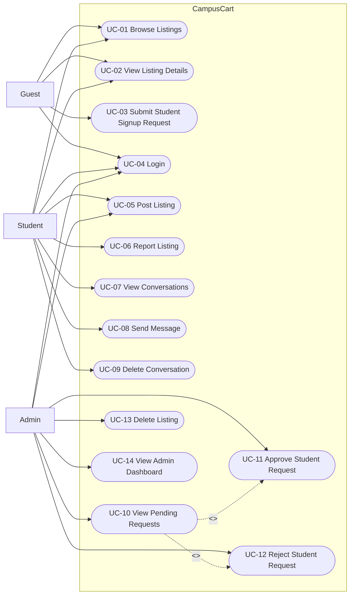

Diagram note: This diagram maps the primary platform capabilities by actor role. Student and Admin share some base marketplace actions while admin-specific moderation actions are isolated. Approval actions are modeled as included behaviors from pending-request review.

## 3. UML Diagrams

### 3.1 Class Diagram

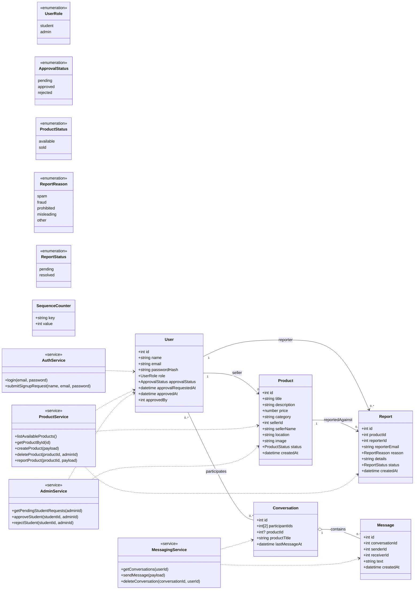

Diagram note: The class model combines core domain entities with service abstractions used by API routes. Relationships align with moderation, listing, and messaging behavior. Enum types encode role/status constraints used in validation and authorization.

### 3.2 Activity Diagram (Marketplace Interaction)

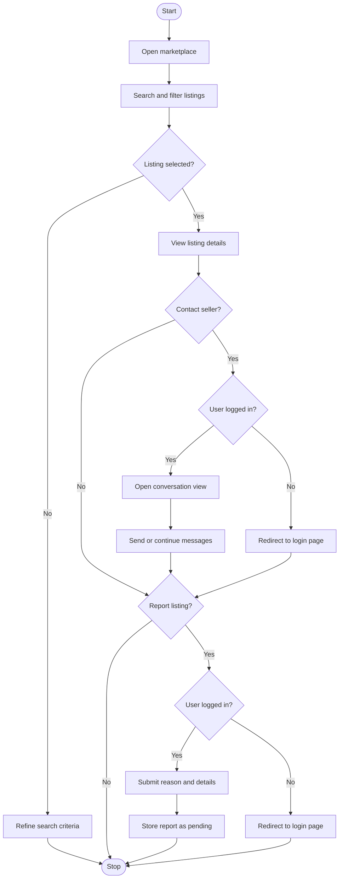

Diagram note: This activity captures core student-side marketplace behavior from browse to interaction. Decision branches show authentication gates around messaging/reporting and preserve guest read-only access.

### 3.3 Sequence Diagrams (Key Workflows)

#### Workflow A: Student Signup, Admin Approval, and Login

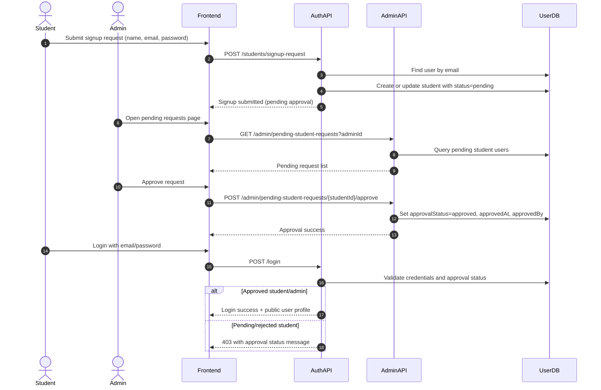

Diagram note: This sequence models the full onboarding gate with a human-in-the-loop approval step. The final login branch enforces the student approval policy consistently with business rules.

#### Workflow B: Create Listing

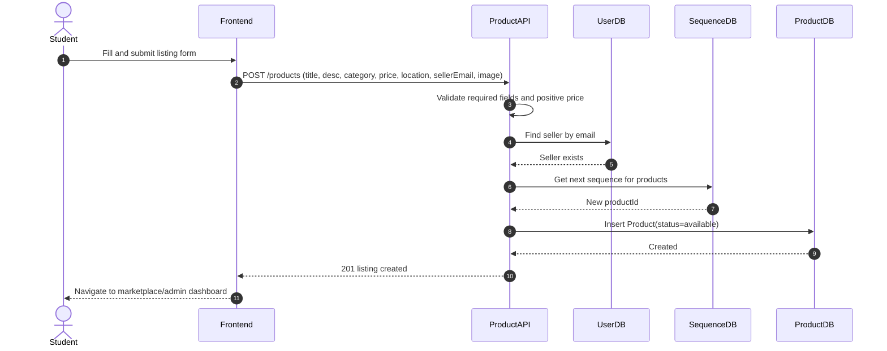

Diagram note: This sequence highlights validation, seller identity resolution, ID generation, and persistence. It also reflects role-shared listing creation for approved students and admins.

#### Workflow C: Messaging in Conversation

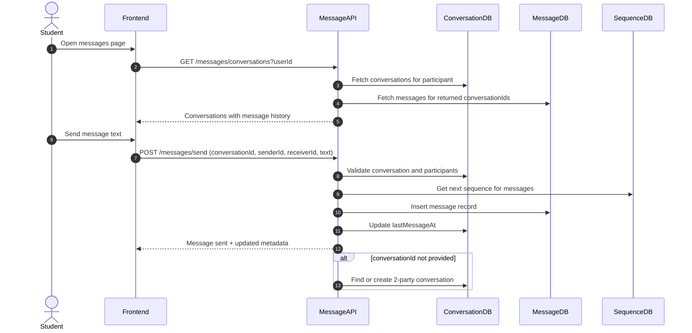

Diagram note: This sequence supports both existing-thread messaging and API-level creation fallback when conversation ID is absent. Participant validation protects conversation access boundaries.

## 4. Collaboration (Communication) Diagrams

### 4.1 Workflow A Collaboration Diagram

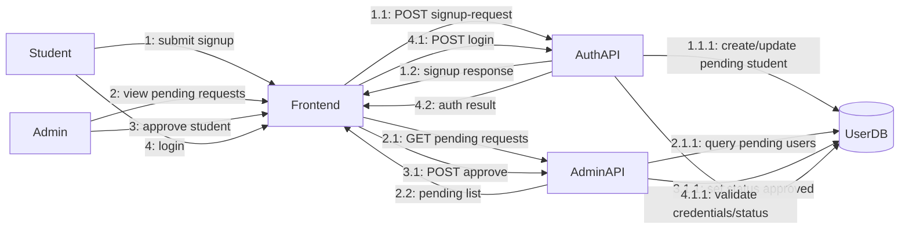

Diagram note: Numbered messages emphasize object collaboration rather than strict time lanes. It matches the same interaction set as Sequence Workflow A.

### 4.2 Workflow B Collaboration Diagram

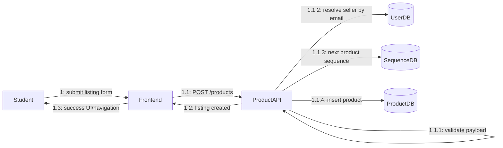

Diagram note: This communication view focuses on responsibility distribution across API logic and persistence components for listing creation. It mirrors Sequence Workflow B.

### 4.3 Workflow C Collaboration Diagram

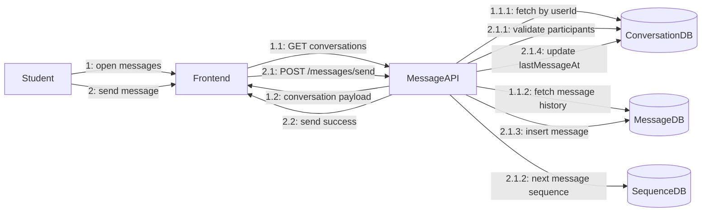

Diagram note: This diagram preserves numbered interactions for read and write message flows. It corresponds directly to Sequence Workflow C.

## 5. DFD (Data Flow Diagrams)

### 5.1 Level 0 DFD (Context Diagram)

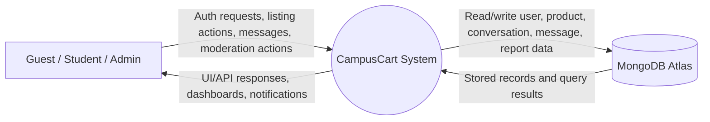

Diagram note: Level 0 treats CampusCart as a single process interacting with external actors and the database service. It defines system boundary and primary data exchanges.

### 5.2 Level 1 DFD

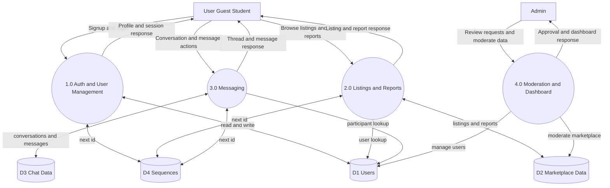

Diagram note: This compact Level 1 view preserves the four core processes while grouping related stores to reduce visual complexity.

## 6. Consistency Mapping (SRS to Diagrams)

| SRS Area | Covered In |
|---|---|
| Authentication and approval gate | UC-03, UC-04, UC-10, UC-11, UC-12; Sequence A; Collaboration A; DFD P1/P4 |
| Product lifecycle and moderation | UC-01, UC-02, UC-05, UC-06, UC-13; Sequence B; Collaboration B; DFD P2 |
| Messaging workflows | UC-07, UC-08, UC-09; Sequence C; Collaboration C; DFD P3 |
| Data model constraints | Class Diagram enums/associations; DFD grouped stores D1-D4 |
| Operational monitoring | FR-18; DFD process boundary and system interactions |

## 7. Summary
CampusCart is a role-based student marketplace with a moderated onboarding model, listing lifecycle controls, and peer-to-peer messaging. The SRS, use cases, UML, and DFD artifacts are synchronized around the same actors, entities, workflows, and business rules.
